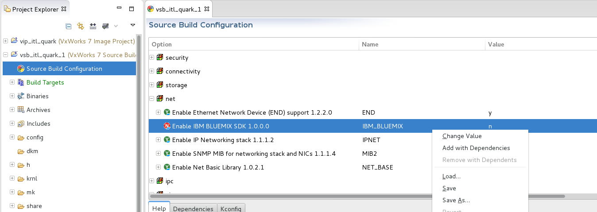
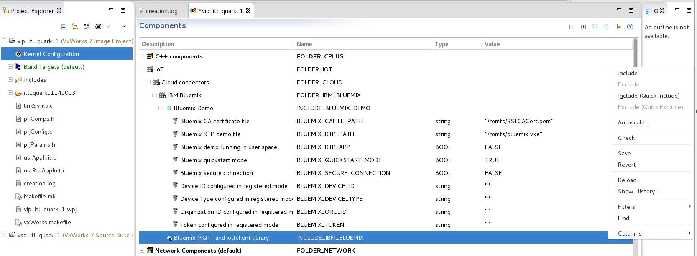
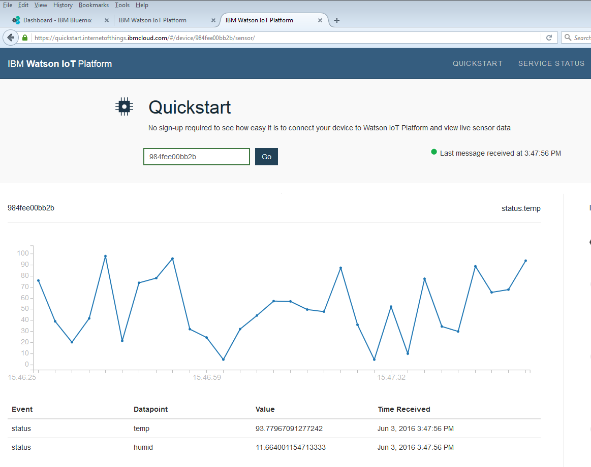
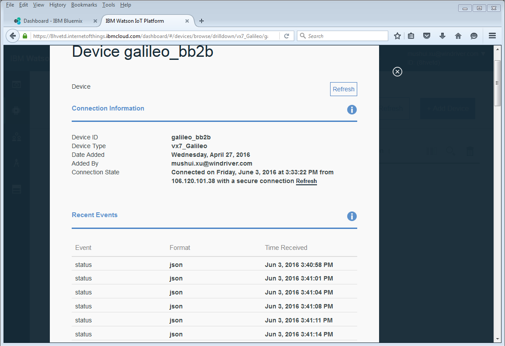

# ##########################################################
#
# VxWorks 7 Bluemix SDK User Guide
#
# ##########################################################

### Overview

This README page provides a quick summary of how to build and run the IBM Bluemix SDK that will reside in VxWorks 7 on your device. The IBM Bluemix SDK is an embedded C client library for interacting with the IBM Watson Internet of Things (IoT) Platform. This client library is not provided in VxWorks 7 RPM packages or on the VxWorks 7 product DVDs . You will need to manually install this library on VxWorks 7.

### Installation

Before using this SDK with VxWorks 7, first download the SDK source code from the maintainer website:

        https://github.com/ibm-messaging/iotf-embeddedc.git

You will then need to apply a patch with some small changes that make the IBM Bluemix SDK compatible for VxWorks 7. Some unnecessary files will need to be removed from the SDK directory. These steps are executed by running the script setup.sh found in the directory bluemix/src.   
* Download the bluemix layer into VxWorks 7  

        cd $WIND_BASE/pkgs/net/  
        mkdir cloud  
        cd cloud  
        git clone https://github.com/Wind-River/vxworks7-bluemix-sdk bluemix

* Run the setup script

        cd $WIND_BASE/pkgs/net/cloud/bluemix/src 
        ./setup.sh 

### VSB and VIP creation using WrTool

The VxWorks 7 VSB (VxWorks Source Build) and VIP (VxWorks Image Project) can be created using either the Wind River Workbench environment or the command line tool WrTool. Below are the steps to create them using WrTool, with the itl_quark BSP as an example.  

* Set environment variable

        export WIND_WRTOOL_WORKSPACE=$HOME/WindRiver/workspace

* Create VSB using WrTool

        wrtool prj vsb create -force -bsp itl_quark vsb_PENTIUM_32_up -S      
        cd vsb_PENTIUM_32_up      
        wrtool prj vsb add IBM_BLUEMIX     
        make -j     

* Create VIP using WrTool

        wrtool prj vip create -force -vsb vsb_PENTIUM_32_up itl_quark gnu vip_quark_kernel -profile PROFILE_STANDALONE_DEVELOPMENT  
        cd vip_quark_kernel  
        wrtool prj vip component add DRV_VXBEND_QRK_GMAC  
        wrtool prj vip component add INCLUDE_SHELL INCLUDE_NETWORK INCLUDE_IFCONFIG INCLUDE_PING  
        wrtool prj vip component add INCLUDE_IBM_BLUEMIX  
        wrtool prj vip parameter set DNSC_PRIMARY_NAME_SERVER   "\"128.224.160.11\""  
        wrtool prj vip parameter set DNSC_SECONDARY_NAME_SERVER "\"147.11.57.128\""  

    The test sample of iotfclient is provided in cfg/usrBluemixDemo.c and in src/bluemixSample.c. It can be used to connect your device to the IBM Bluemix cloud, to publish events to the cloud, and to subscribe to commands from the IBM Bluemix cloud. To enable this sample, you need to add the INCLUDE_BLUEMIX_DEMO component, as shown below: 

        wrtool prj vip component add INCLUDE_BLUEMIX_DEMO

    If you want to create a connection to the quickstart service, set parameters as follows:

        wrtool prj vip parameter set BLUEMIX_QUICKSTART_MODE    TRUE

    If you want to create a connection to a registered service, set parameters as follows:  

        wrtool prj vip parameter set BLUEMIX_QUICKSTART_MODE    FALSE  
        wrtool prj vip parameter set BLUEMIX_DEVICE_ID          "\"galileo_bb2b\""  
        wrtool prj vip parameter set BLUEMIX_DEVICE_TYPE        "\"vx7_Galileo\""  
        wrtool prj vip parameter set BLUEMIX_ORG_ID             "\"8hvetd\""  
        wrtool prj vip parameter set BLUEMIX_TOKEN              "\"dhVLQ1U7@yqAffPME7\""  

    NOTE: The values of the above four parameters should be consistent with the information of the device registered in the IBM Watson IoT platform.  

    To set up a secure connection over SSL, first include the OPENSSL layer in the VSB, as follows:  

        wrtool prj vsb add OPENSSL  

    Then you can set BLUEMIX_SECURE_CONNECTION to either TRUE or FALSE in the VIP, depending on whether a secure connection is required. The default value is TRUE.  

        wrtool prj vip parameter set BLUEMIX_SECURE_CONNECTION  TRUE  
        wrtool prj vip parameter set BLUEMIX_CAFILE_PATH        "/romfs/SSLCACert.pem"   
        mkdir romfs   
        cp $WIND_BASE/pkgs/net/cloud/bluemix/certs/SSLCACert.pem ${VIP_DIR}/romfs   

    or  

        wrtool prj vip parameter set BLUEMIX_SECURE_CONNECTION   FALSE  

    The Bluemix sample can also be run in VxWorks user space (i.e., in a VxWorks RTP). A Bluemix RTP file bluemix.vxe is generated in ${VSB_DIR}/usr/root/gnu/bin when building the VSB. To auto-spawn the demo in an RTP, you need to add the INCLUDE_ROMFS component, then set parameter BLUEMIX_RTP_APP to TRUE, and set BLUEMIX_RTP_PATH to "/romfs/bluemix.vxe", as shown below:  

        wrtool prj vip component add INCLUDE_ROMFS  
        wrtool prj vip parameter set BLUEMIX_RTP_APP            TRUE  
        wrtool prj vip parameter set BLUEMIX_RTP_PATH           "/romfs/bluemix.vxe"  
        mkdir romfs  
        cp ${VSB_DIR}/usr/root/gnu/bin/bluemix.vxe romfs  
        wrtool prj vip build  

    Now you can bring up your device, and it will auto-run the Bluemix SDK in a VxWorks RTP. 

### VSB and VIP creation using workbench

* Create VSB using workbench

    - Open Workbench 4, click File -> New -> Wind River Workbench Project, and select "Build type" as "Source Build", setup the project based on board support package or CPU.

    - After creating VSB project, Open "Source Build Configuration" in project explorer of vsb_itl_quark_1, find IBM BLEMIX layer in net option folder, right click and then click "Add with Dependencies" to add IBM_BLUEMIX layer, as shown in the figure below.

    

    - Use the same way to add OPENSSL layer in this project. In the last, save the configuration and build the VSB.

* Create VIP using workbench

    - After you done VSB building, click File -> New -> Wind River Workbench Project, and select "Build type" as "Kernel Image". Setup the project based on existed VSB vsb_itl_quark_1 which has already created in the above section and then select profile as "PROFILE_STANDALONE_DEVELOPMENT".

    - After creating VIP project, you need to configure components and parameters in "Kernel Configuration" in VIP project explorer as shown in the figure below.

    

    - You need to include the component INCLUDE_IBM_BLUEMIX. If you want to run a demo, you also need to include the component IBM_BLUEMIX_DEMO. About how to set parameters, you can refer to the above section "Create VIP using WrTool".

### View the device information at website

You can run your device image with the Bluemix SDK and then view the device information dashboard at the IBM Bluemix website.

* For the quickstart connection  
    View connection status here:

    'https://quickstart.internetofthings.ibmcloud.com/#/device/'

    Note: The device MAC address needs to be entered on this page, and it must be in lower case as shown in the figure below:

    

* For the registered connection  
    View the device connection status here:  

    'https://${ORG_ID}.internetofthings.ibmcloud.com/dashboard/#/devices/browse'  

    Replace ${ORG_ID} with your organization's ID that is registered in IBM Bluemix. For example:

    'https://8hvetd.internetofthings.ibmcloud.com/dashboard/#/devices/browse'

    Connection status is showed in the figure below:

    

* View application dashboard  
    You can also create the Node-RED application in the IBM Bluemix platform and view the application dashboard here:

    'https://console.ng.bluemix.net/?direct=classic/#/resources'
